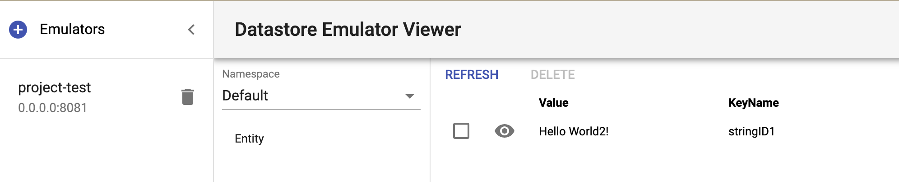

# Datastore Emulator Viewer
At the moment, a simple GUI for Google Cloud Datastore in Emulator Mode during development.

## Why it Born

I make this Server in Gin(Golang) which is the backend to connect datastore emulators, and the client is ReactJs which copy from [Google Clound GUI](https://github.com/GabiAxel/google-cloud-gui).

I have found `Google Clound GUI` cannot work well with me in latest node, and I want to see the data in datastore emulator with gui, so I make the backgroun with golang.

## Work with Docker

I have made Dockerfiles with server&client.

you can start it with 

```docker-compose build && docker-compose up```

## Want to Development

The project is composed of `server` and `client` directories. To run locally:

* Under `client` run `yarn start` or `npm start` - this will start a development server on port 3000 and open the browser at `http://localhost:3000`

* Under `server` run `go run main.go` - this will start the server on port 8000 with Golang(Gin).

## Using the GUI

I have followed the client with [Google Clound GUI](https://github.com/GabiAxel/google-cloud-gui).
You can see more operation in [Google Clound GUI](https://github.com/GabiAxel/google-cloud-gui).



## More

Make emulator Docker image

```
version: "3"

services:
  datastore:
    image: singularities/datastore-emulator
    environment:
      - DATASTORE_PROJECT_ID=[Your Project ID]
      - DATASTORE_LISTEN_ADDRESS=[You host IP&Port]
    ports:
      - "8081:8081"
```

Thanks For GabiAxel about [Google Clound GUI](https://github.com/GabiAxel/google-cloud-gui).
